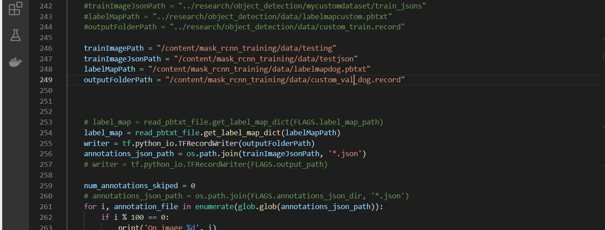

##                                                                                                                                                                               
## MASK RCNN Using Tensorflow OBJECT DETECTION API

**Name: kishor G**

**Email: kishorbrindha18@gmail.com**

In June 2017, Google opened the TensorFlow Object Detection API. This project uses TensorFlow to implement most of the deep learning target detection frameworks, including MaskRCNN in reality.

<https://github.com/tensorflow/models/tree/master/research/object_detection>

<https://github.com/tensorflow/models/tree/v1.13.0>

MASK RCNN Model link :-

<http://download.tensorflow.org/models/object_detection/mask_rcnn_inception_v2_coco_2018_01_28.tar.gz>

**Data Annotation:**

In data annotation, we will be using **Labelme Tool**

Download the Tool from the given Link:-

<https://github.com/wkentaro/labelme>

**Installation of Labelme:**

conda create --name=labelme python=3.6

conda activate labelme

\# conda install -c conda-forge pyside2

\# conda install pyqt

\# pip install pyqt5  # pyqt5 can be installed via pip on python3

pip install labelme

labelme

Then the interface of labelme will popup.

Click on **Open Dir** and select the folder where your test images or train images are. Then start labelling all images in the dataset.

The selected image is loaded in the Labelme Interface.

Click on **Start Drawing Polygons.**

Create the Polygon Box and write the Label name corresponding to the image

.

Click on the Save button and a corresponding JSON file will be saved in the directory with the image.

**NEXT**

**Split the dataset into 80:20 ratio for train and validation(use splitfolders Library)** 

Create a new folder named Data in your local system. This is where we will be 

keeping our own trainingdata,testdata,trainjson(annotated),testjson(annotated),label

map.pbtxt,read\_pbtxt,read\_pbtxt\_file,setup.py,string\_int\_label\_map\_pb2 and 

create\_tf\_records. 

**create\_tf\_records:** 

**   As we are using TFOD framework for training maskrcnn you have to convert all the trainjson and testjson annotated images to tf\_records. So we use create\_tf\_record.py file and we will perform the conversion. 

**read\_pbtxt ,read\_pbtxt\_file,string\_int\_label\_map\_pb2** are helper file for **c**reate\_tf\_records.py file

**Setup.py:**

** As we are following modular coding approach we create a setup.py file and install it to make object\_detection as local package.

**labelmap.pbtxt:**
**

`  `** The label map tells the trainer what each object is by defining a mapping of class names to class ID numbers. Use a text editor to create a new file and save it as labelmap.pbtxt

Replace the names of the classes with your class names.

This is a sample one.

Zip the data folder and keep it ready we will be using this folder later.

 **Colab\_file\_link :** <https://colab.research.google.com/drive/1NmyMeMqmGT2uDHIPjh6WnC6MYK4XHY4e?usp=sharing>

 **GOOGLE\_COLAB\_SETUP:**

- **Step1: Mount your Google drive**

- **Step 2: Download the tensorflow repository**

- **Step 3: Download the mask rcnn pretrained model and unzip it**

- **Step 4: Install necessary requirements**

- **Step 5: upload data and other requirements in zip file format(data.zip)**

- **step 6: convert .json to .tf-records and create tf-records**
**

`                                            `Changes in create\_tf\_records.py for both train and test     Data:

- trainImagePath(index-246)
- trainImagePath(json)
- labelMapPath
- outputFolderPath(index-249)

`                                            `Change the path for both training and test data save and

`                                            `close the file. 

Train data:

     

Test data:

- **Step 7: move the custom\_train\_dog.record ,custom\_val\_dog.record and setup.py to research folder. And install setup.py.**

- **Step 8: create a folder named training in research folder and move frozen\_inference\_graph.pb from mask\_rcnn(pretrained\_model) folder to training folder,move labelmap.pbtxt from data folder to training folder. And copy the file named mask\_rcnn\_inception\_v2\_coco.config from the given path [/content/mask_rcnn_training/models/research/object_detection/samples/configs/mask_rcnn_inception_v2_coco.config](https://colab.research.google.com/drive/1NmyMeMqmGT2uDHIPjh6WnC6MYK4XHY4e) and paste it in training folder**

**Step 9: changes to be made in mask\_rcnn\_inception\_v2\_coco.config**

`                                   `Changes:

- 10->num\_classes-1

- 127->fine\_tune\_checkpoint-"mask\_rcnn/model.ckpt"

- 133->num\_steps- 200

- 142->input\_path-"custom\_train\_dog.record"

- 144->label\_map\_path-"training/labelmapdog.pbtxt"

- 158->input path-"custom\_val\_dog.record".

- 160->label\_map\_path-"training/labelmapdog.pbtxt"

`                                   `Make the above changes save and close the file

**                All the red box cells contain the path that I am using. It may change                     based on your preferences.

**Step 10: copy train.py from object\_detection/legacy and paste the file in research folder and start the training**

- Start the training 

- Command for training: !python train.py --logtostderr --train\_dir=training/ --pipeline\_config\_path=training/mask\_rcnn\_inception\_v2\_coco.config

**Step 11: ckpt to pb conversion**

- See the training/model.ckpt and give the latest ckpt number in the command for the conversion.

- Command for conversion: !python export\_inference\_graph.py --input\_type image\_tensor --pipeline\_config\_path training/mask\_rcnn\_inception\_v2\_coco.config --trained\_checkpoint\_prefix training/model.ckpt-200 --output\_directory frozen\_inference\_graph

- Training has completed sucessfully and model has been saved in research/frozen\_inference\_graph/ utilize that model for infrencing.

Now we can use this frozen\_inference\_graph.pb model to predict.

 **Now lets predict : -**

- **Step 1: Necessary imports**

- **Step 2: Model preparation**

`  `Changes:

- PATH\_TO\_FROZEN\_GRAPH

- PATH\_TO\_LABLES

- **Step 4: Load a (frozen) Tensorflow model into memory.**

- **Step 5: Loading label map.**

- **Step 6: Helper code.**

- **Step 7: upload test images and unzip it (test\_image.zip).**

- **Step 8:Detection**

Test data must be named as image1,image2,image3…..etc. This is done to  access the images easily.

Only you have to change the for loop if 5 images then range(1,6) if 20 image range(1,21) etc. And change the PATH\_TO\_IMAGES\_DIR relative to your path were the test images is available. 

**Now execute all the remaining cells of the notebook and your test pictures will be displayed at the last cell.**

**RESULT:**

**CONCLUSION:**

`           `I have trained the maskrcnn model with dog dataset for only  600 steps and I have got a pretty good result. If you increase the steps and dataset size your accuracy will increase.** Data argumentation and data annotation must be done very carefully.**

`                     `
             

